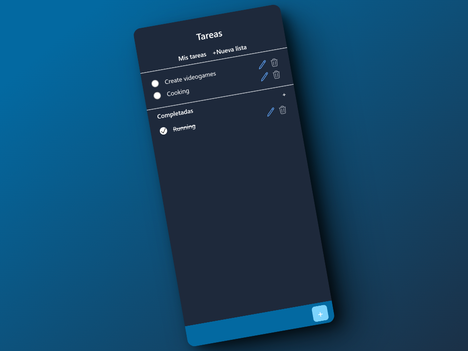

## Todo React App



This is a simple task management application built with React. The app allows users to add, delete, and mark tasks as completed. It also provides a user interface for managing and viewing tasks.

### Install

1. Clone this repository

   ```sh
   git clone ?
   ```

2. Install dependencies using pnpm.

   ```sh
   pnpm install
   ```

3. Start your build process
   ```sh
   pnpm run dev
   ```

#### Additional Commands

##### Build

To create a production build of your application, use the following command:

```
pnpm build
```
## 🛠️ Stack
 

